# Final Project Book Library

## Click on client or server to read the README file for each one , or read both here.

## Book Library Frontend

I have created a responsive book library using React for the frontend and MongoDB for the backend.

### Links

- Frontend: https://books-library.netlify.app/
- Backend: https://books-library-backend.cyclic.app/api/v1/books
- Backend github: https://github.com/HasanOmar1/Books-Library-backend

---

## About

- Login and Sign-up with authorization.
- Each book has its own about page.
- You can read a book.
- You can add a book to your library.
- You can remove a book from your library.
- You can comment on a book.
- You can remove your comment.
- You can add your own book.
- You can delete your own book.
- You can search for a book.

---

- There are categories based on each book's category.
- There is a category for books added by people.
- You can check out books written by well known authors.
- There are Fairy Tales books.

---

### Things to know

I have used puppeteer package to scrap books pages.

- The pages of the Fairy Tales are real pages.
- The pages of the other books are the same.

I couldn't find real pages for the other books so i just scraped random chapter

of a book and added it to the pages just to fill them.

- You can click on the email icon in the footer to contact me.

---

### Used packages

- Material UI
- Bootstrap
- React Page Flip

---

## Preview

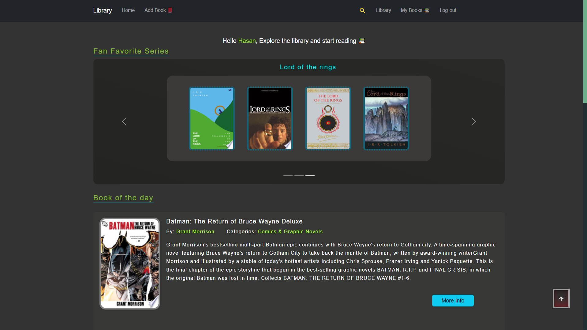
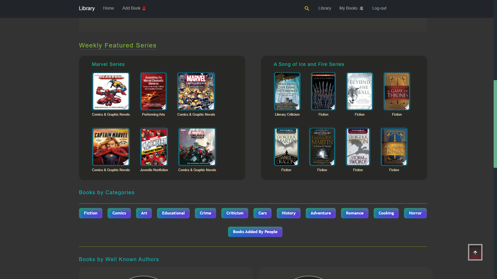
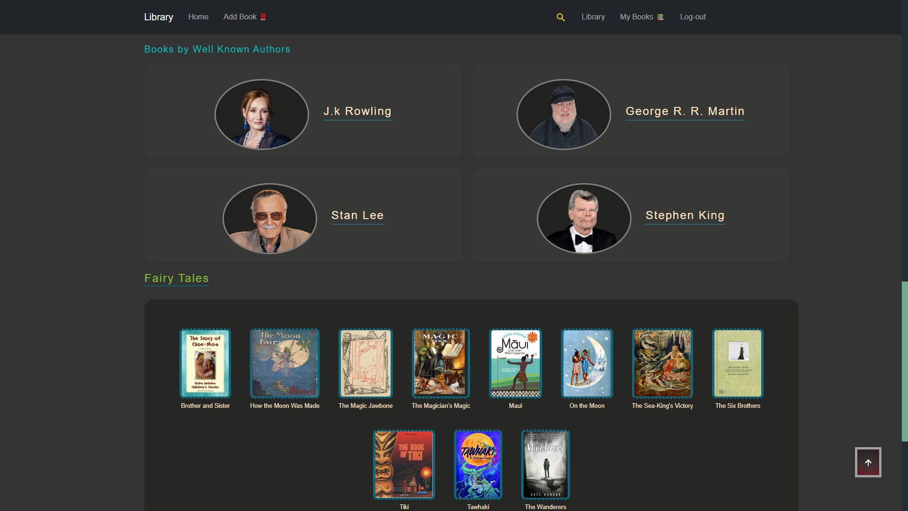
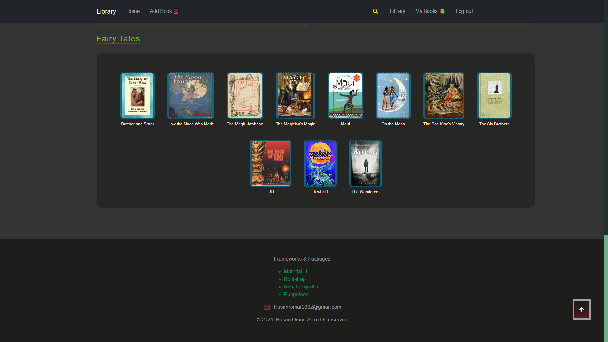
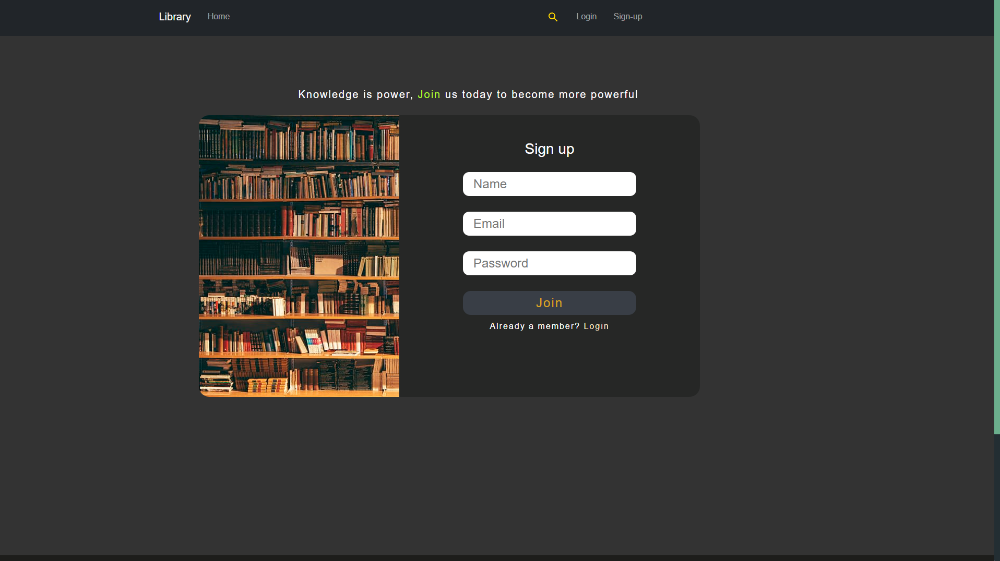
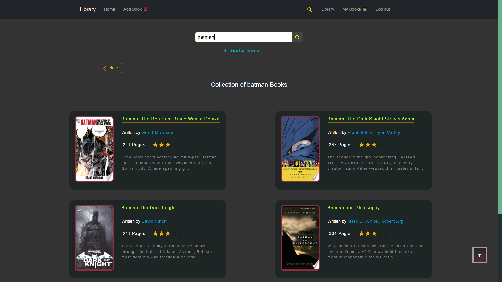
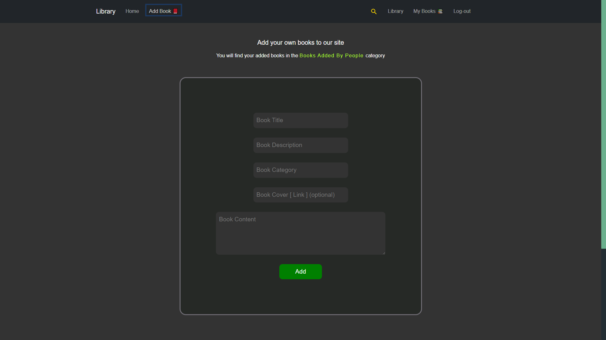
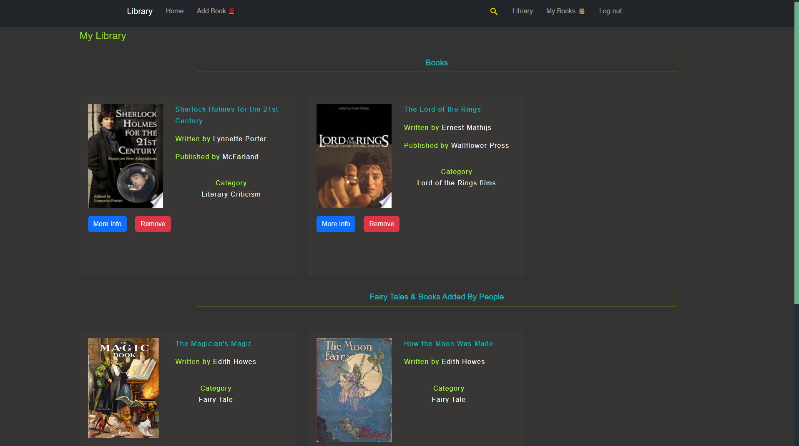
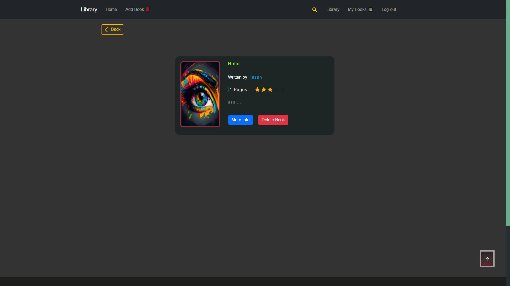
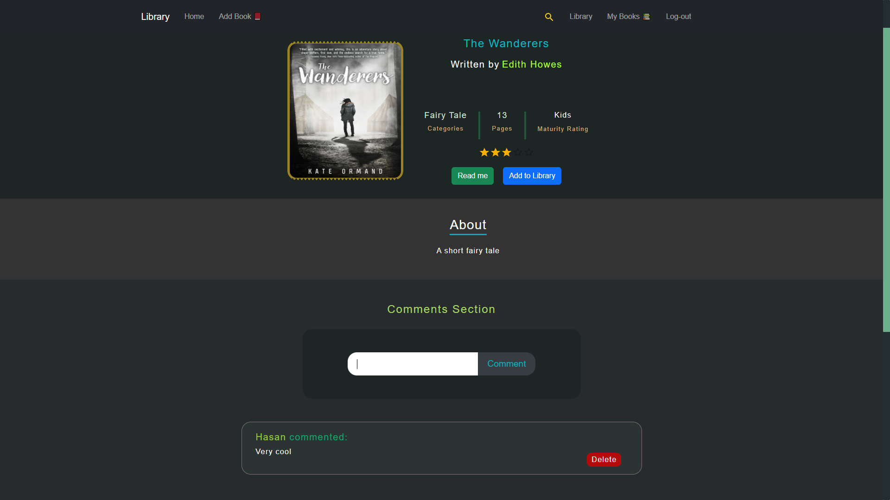
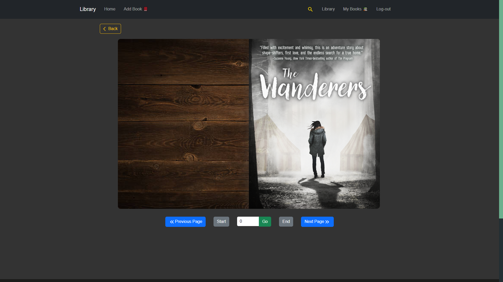
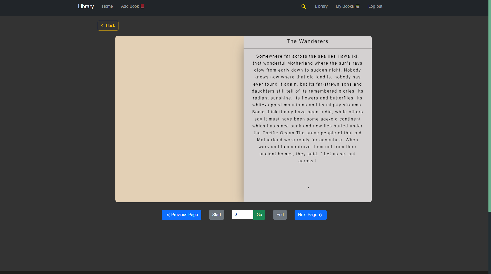

---

# Book Library Backend

I have created a responsive book library using React for the frontend and MongoDB for the backend.

### Links

- Backend: https://books-library-backend.cyclic.app/api/v1/books
- Frontend: https://books-library.netlify.app/
- Frontend github: https://github.com/HasanOmar1/Books-library-frontend

---

### Used packages

- Mongoose
- Express
- Dotenv
- Cors
- Bcrypt
- JWT Token
- Puppeteer

---

## About

- There are four schemas. [User , Books , FairyTales , Comments]
- There are authorization tokens for each user.
- There is an error middleware.
- I used puppeteer locally because i couldn't deploy my backend with it. [puppeteer.js shows the work]

---

### Endpoints

- https://books-library-backend.cyclic.app

- Routes
  

- Users
  

- Books
  

- FairyTales
  

- Comments
  
